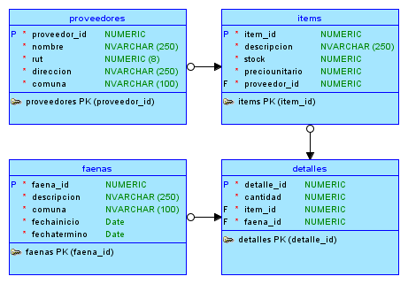

# springmvc-ejemplo-faenas

## Modelo de Datos




## Consideraciones

Modificar los siguientes valores del archivo `root-context.xml` ubicado en `src/main/webapp/WEB-INF/spring`

```xml
<!-- Configuración de la Base de Datos -->
<bean id="dataSource" class="org.springframework.jdbc.datasource.DriverManagerDataSource">
    <!-- Driver -->
    <property name="driverClassName" value="oracle.jdbc.OracleDriver" />

    <!-- URL de conexión -->
    <property name="url" value="jdbc:oracle:thin:@localhost:1521:xe" />

    <!-- Nombre de Usuario -->
    <property name="username" value="ejemplos" />

    <!-- Contraseña de Acceso -->
    <property name="password" value="ukdvs9YG6VU7J2cA76GJxUOmvJFAl7" />
</bean>
```

Previa o posteriormente a la modificación de los datos, se deben cargar los archivos `schema.sql` y `data.sql` en la base de datos
